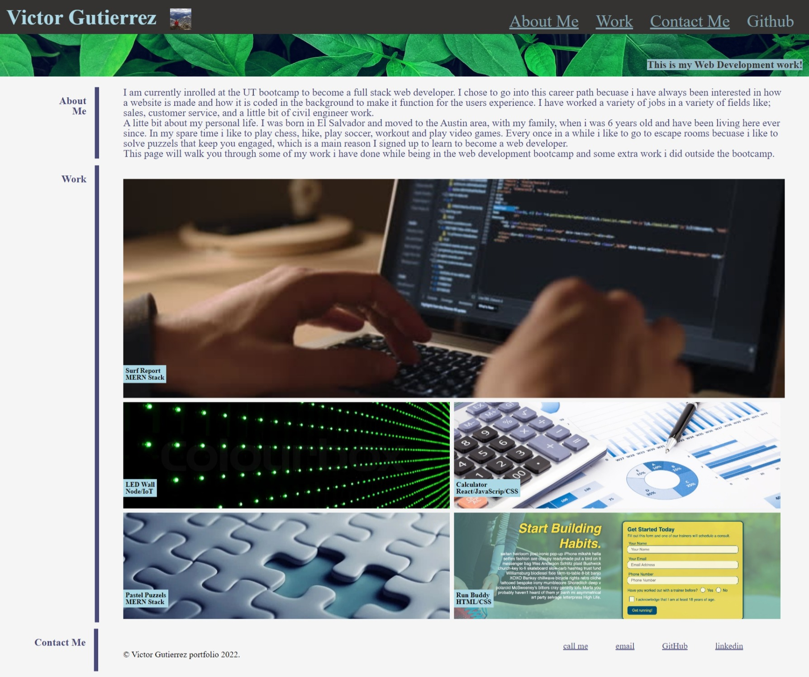

# challange-2 Portfolio

## Overall 
This weeks challange was to create an interactive portfolio so we could showcase out work to future employers.
We had to impliment clickable images that took you to the git repo with the work for that section. Right now since it is just the beginning of class the git repos will take you to some of the inclass mini projects we have done so far. 

### sources and citations:

* link a)https://www.itechnewsonline.com/scheduledthreadpoolexecutor-in-python/
* link b) https://unsplash.com/photos/frWOcVisp8U 
* link c) https://www.colourbox.com/image/led-wall-background-image-1908935
* link d) https://ak.picdn.net/shutterstock/videos/3556961/thumb/4.jpg
* link e) https://img1.goodfon.com/wallpaper/nbig/5/f1/paper-calculator-economy.jpg
* link f) https://user-images.githubusercontent.com/77648727/107858055-eb266600-6de6-11eb-80a7-3dfeeaa5ec4b.png
* youtube video on grid property
* w3 school on grid property
### URL to the GitHub Repo and Deployed Application: 
https://github.com/VictorGutierrez25/challange-2
 
http

#### screenshot:
 

